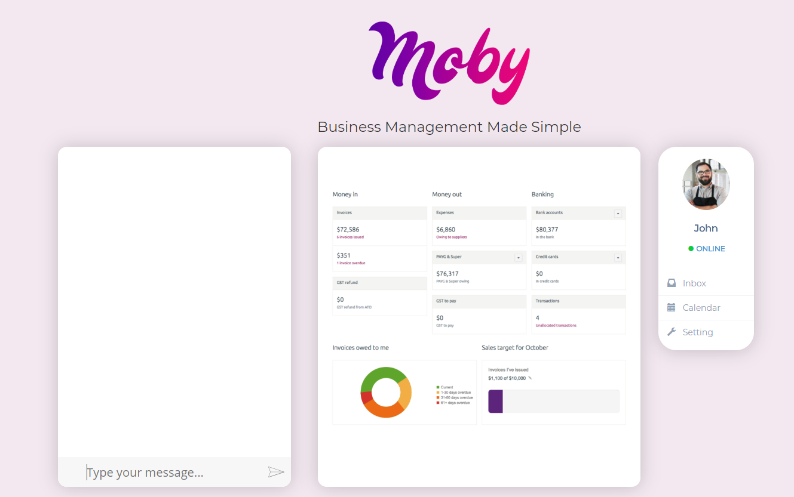
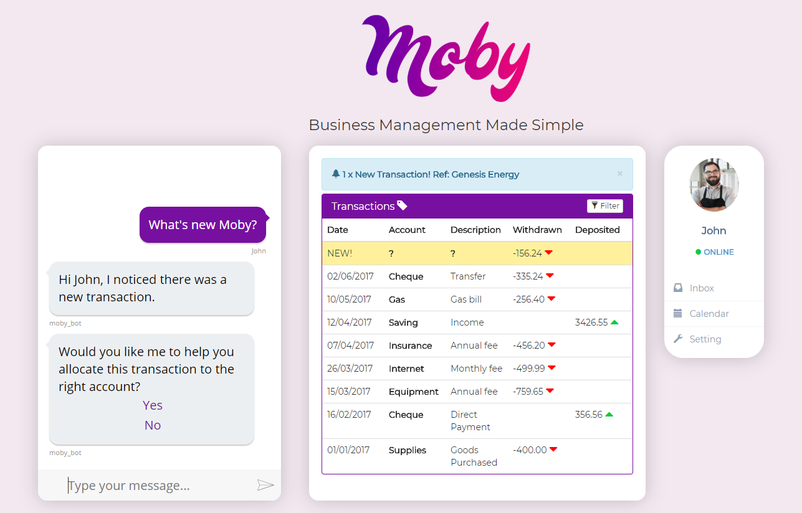
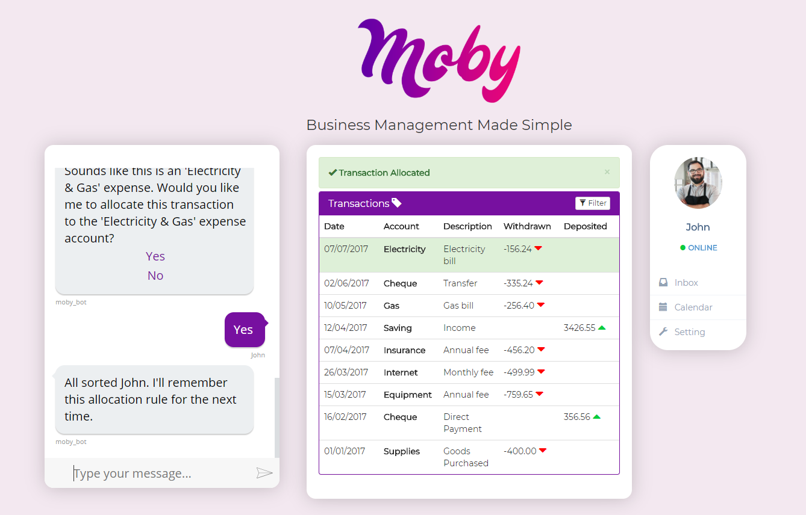
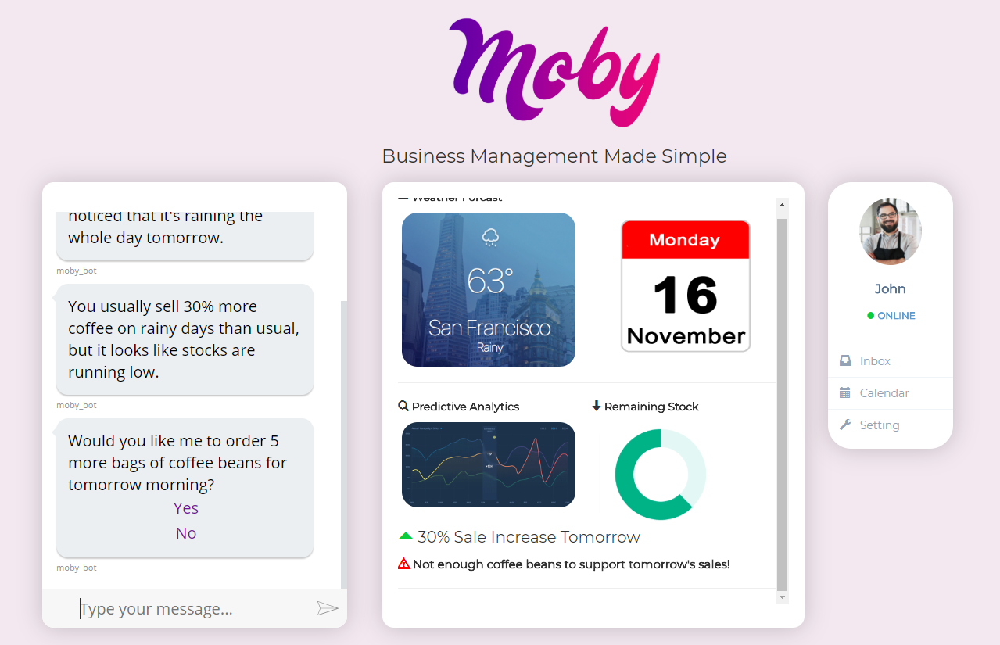
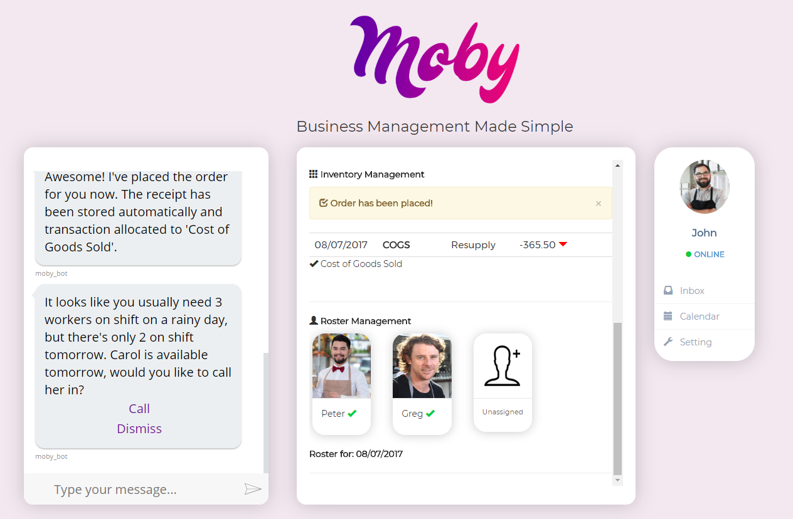
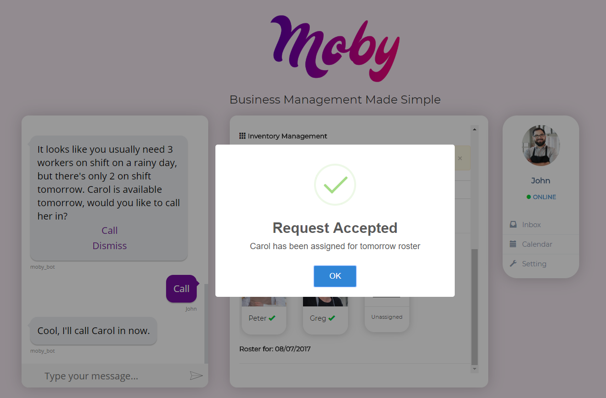

# Moby - Business Management Made Simple

Moby is a proof of concept prototype chatbot that demonstrate how machine learning can empowered SME business onwers.

Moby utilizes the Microsoft bot framework, which operates through Azure cloud services with multi-channels deployment supports. 
This means that Moby can be easily scaled on to major platforms such as Facebook, and Skype in the future. 

Moby’s backend is powered by Microsoft cognitive services, with LUIS (Language Understanding Intelligence Service) integration, creating an almost human-like interaction between the users and the platform. With the speech analysis API, Moby is voice recognition, and natural language enabled allowing it
to differentiate varying intents, and provides appropriate feedback depending on what the user’s needs.

## Business Management

## Actionable and Data Driven Advice

## Technology
- Microsoft Bot Framework
- Microsoft Q&A Maker
- Azure Cloud Service
- Front-End: HTML, CSS, JS, Bootstrap
